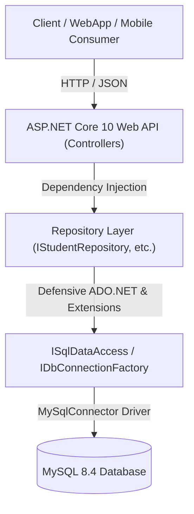
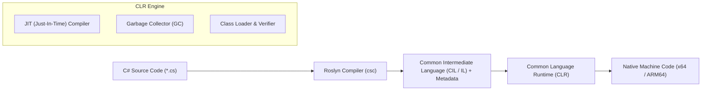
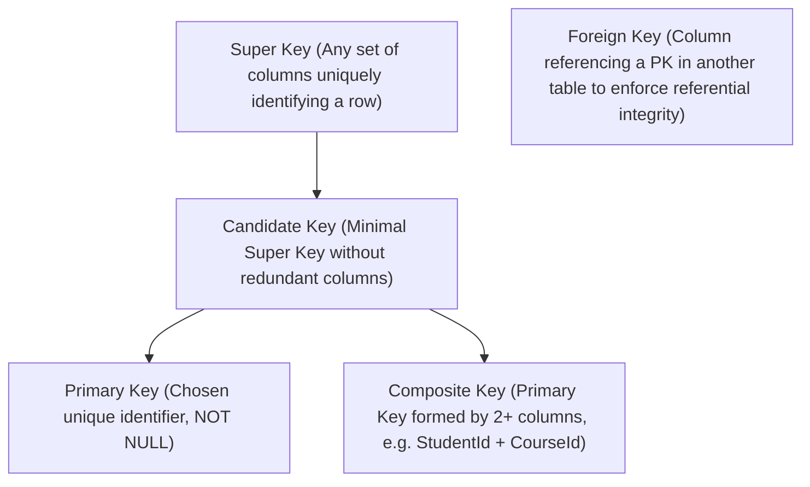

# Student Registration Portal (Enterprise C# .NET 10 & MySQL)

An enterprise-grade academic management system designed to handle university student registrations, courses, instructors, class scheduling, attendance tracking, grading, and academic holds. Built using **C# .NET 10 Web API**, **Native ADO.NET (MySqlConnector)**, and **MySQL 8.4**.

---

## Table of Contents

1. [Project Overview & Architecture](#1-project-overview--architecture)
2. [Project Status Tracker (Done vs To-Do)](#2-project-status-tracker-done-vs-to-do)
3. [C# & Object-Oriented Programming (OOP) Concepts](#3-c--object-oriented-programming-oop-concepts)
   - [What is a Class?](#what-is-a-class)
   - [Class Methods vs Extension Methods](#class-methods-vs-extension-methods)
   - [Access Modifiers](#access-modifiers)
   - [C# Data Types & Memory Management](#c-data-types--memory-management)
4. [.NET Core Runtime Architecture](#4-net-core-runtime-architecture)
   - [CLR (Common Language Runtime)](#clr-common-language-runtime)
   - [CLS (Common Language Specification) & CTS](#cls-common-language-specification--cts)
   - [GAC (Global Assembly Cache) & Modern Assembly Probing](#gac-global-assembly-cache--modern-assembly-probing)
5. [Database Concepts & Architecture](#5-database-concepts--architecture)
   - [Super Key vs Primary Key vs Foreign Key vs Composite Key](#super-key-vs-primary-key-vs-foreign-key-vs-composite-key)
   - [Database Views](#database-views)
   - [Stored Procedures & CRUD Operations](#stored-procedures--crud-operations)
   - [Database Triggers](#database-triggers)
   - [Index Seek vs Index Scan](#index-seek-vs-index-scan)
   - [Synonyms & Database Transactions](#synonyms--database-transactions)
   - [Processing Status & Output Messages Pattern](#processing-status--output-messages-pattern)
6. [Ready-to-Use Database Scripts (Views, SPs, Functions, Triggers)](#6-ready-to-use-database-scripts)
7. [How to Run & Debug Locally](#7-how-to-run--debug-locally)

---

## 1. Project Overview & Architecture

The application adopts a **3-Tier / Domain-Driven Design (DDD)** architecture with **Pure ADO.NET**:



    subgraph "Core Domain Entities"
        Students["Students"]
        Instructors["Instructors"]
        Courses["Courses"]
        Enrollments["Enrollments"]
        Schedules["Course Schedules & Sessions"]
        Lectures["Lectures & Attendance"]
    end

    API --- Students
    API --- Instructors
    API --- Courses
    API --- Enrollments
    API --- Schedules
    API --- Lectures
```

### Layer Breakdown
* **Database Layer (MySQL)**: 24 relational tables enforcing referential integrity, indexes, views, stored procedures, functions, and audit triggers.
* **API Layer (C# .NET 10 Web API)**: RESTful controllers, dependency injection, validation middleware, and EF Core data mapping.
* **WebApp / Client Consumer**: Frontend application consuming REST endpoints for student self-service registration and administrative oversight.

---

## 2. Project Status Tracker (Done vs To-Do)

| Feature / Component | Status | Details |
| :--- | :---: | :--- |
| **MySQL 8.4 Container Setup** | ✅ Completed | Running on port `3306` via Docker (`studentportal-mysql`) |
| **24 Relational Entity Classes** | ✅ Completed | Located in [Entities/](file:///home/kbassem10/code/eFinance/Entities) with navigation properties & data constraints |
| **EF Core DbContext Mapping** | ✅ Completed | [ApplicationDbContext.cs](file:///home/kbassem10/code/eFinance/Data/ApplicationDbContext.cs) with full model builder definitions |
| **.NET 10 Compatibility & Build** | ✅ Completed | Configured `MySql.EntityFrameworkCore 10.0.*` with 0 errors / 0 warnings |
| **VS Code Debugger Configuration** | ✅ Completed | Configured `.vscode/launch.json` and `.vscode/tasks.json` |
| **Schema Generation (`EnsureCreated`)** | ✅ Completed | Auto-creates all 24 tables upon application launch |
| **Entity Helper & Extension Methods** | ⏳ In Progress | Adding domain helper getters & extension methods for core entities |
| **Database Views for all Entities** | ⏳ Script Provided | SQL view definitions provided in Section 6 |
| **CRUD Stored Procedures with ActionType** | ⏳ Script Provided | Stored procedures with `ProcessingStatus` & `ProcessingMessage` |
| **Credit Hour Aggregation Function** | ⏳ Script Provided | `fn_GetStudentTotalCreditHours(student_id, semester_id)` |
| **Business Rule Triggers & Validations** | ⏳ Script Provided | NationalId uniqueness, year rules (< 2026), status validations |
| **REST API Controllers** | ⏳ Upcoming | CRUD endpoints for Student, Instructor, Course, Enrollment |
| **Authentication & Role Authorization** | ⏳ Upcoming | JWT-based auth with `UserRoles` & Claims |

---

## 3. C# & Object-Oriented Programming (OOP) Concepts

### What is a Class?
A **Class** in C# is a blueprint or template from which individual objects are instantiated. It encapsulates data (fields and properties) and behaviors (methods/functions and events).

```csharp
public class Student
{
    // State (Properties)
    public int StudentId { get; set; }
    public string FirstName { get; set; } = string.Empty;
    public string LastName { get; set; } = string.Empty;
    public string Email { get; set; } = string.Empty;

    // Behavior (Instance Method / Function)
    public string GetFullName() => $"{FirstName} {LastName}";
    public string GetStudentInfo() => $"ID: {StudentId} | Name: {GetFullName()} | Email: {Email}";
}
```

---

### Class Methods vs Extension Methods

| Feature | Class Instance Method | Extension Method |
| :--- | :--- | :--- |
| **Definition** | Declared inside the class itself | Declared in a separate `static class` using `this` modifier |
| **Access to Private State** | Can access `private` and `protected` fields | Can only access `public` members |
| **Modification Needed** | Requires modifying or subclassing the original class | Can extend any class (even third-party or sealed types) |
| **Invocation Syntax** | `student.GetFullName()` | `student.GetFormattedBadge()` (looks identical to the caller) |

#### Example: Class Method vs Extension Method
```csharp
// 1. Inside the Entity Class (Class Method)
public class Student
{
    public int StudentId { get; set; }
    public string FirstName { get; set; } = string.Empty;
    public string LastName { get; set; } = string.Empty;
    public decimal GPA { get; set; }

    public string GetFullName() => $"{FirstName} {LastName}";
}

// 2. In a separate Utilities file (Extension Method)
public static class StudentExtensions
{
    public static string GetAcademicStanding(this Student student)
    {
        if (student == null) return "Unknown";
        return student.GPA switch
        {
            >= 3.5m => "First Class Honours / Dean's List",
            >= 3.0m => "Very Good Standing",
            >= 2.0m => "Good Standing",
            _ => "Academic Probation"
        };
    }
}
```

---

### Access Modifiers

C# provides 6 levels of accessibility:

1. **`public`**: Accessible from any code in the same assembly or another assembly referencing it.
2. **`private`**: Accessible only within the declaring class/struct.
3. **`protected`**: Accessible only within the declaring class and derived classes.
4. **`internal`**: Accessible only within files in the same assembly (`.dll`).
5. **`protected internal`**: Accessible in the same assembly OR from derived classes in other assemblies.
6. **`private protected`**: Accessible in the declaring class OR derived classes within the **same** assembly.

---

### C# Data Types & Memory Management

| Category | Types | Memory Location | Behavior |
| :--- | :--- | :--- | :--- |
| **Value Types** | `int`, `long`, `decimal`, `float`, `double`, `bool`, `struct`, `enum`, `DateOnly` | **Stack** (or inlined within containing object on Heap) | Passed by value (copied). Cannot be `null` unless marked nullable (`int?`). |
| **Reference Types** | `class`, `string`, `interface`, `delegate`, `record`, arrays, `List<T>` | **Heap** (with references stored on Stack) | Passed by reference. Garbage collected by CLR. |

---

## 4. .NET Core Runtime Architecture



### CLR (Common Language Runtime)
The execution engine of .NET that handles:
* **JIT Compilation**: Converts Intermediate Language (IL) into CPU-specific machine instructions on the fly.
* **Garbage Collection (GC)**: Automatic memory allocation and reclamation across Generation 0, 1, and 2 heaps.
* **Thread Management & Exception Handling**: Enforces structured exception dispatching and thread safety.

### CLS (Common Language Specification) & CTS
* **CTS (Common Type System)**: Defines all data types and programming constructs supported by .NET.
* **CLS (Common Language Specification)**: A subset of CTS rules ensuring seamless interoperability between different .NET languages (C#, F#, VB.NET).

### GAC (Global Assembly Cache) & Modern Assembly Probing
* **Legacy .NET Framework (GAC)**: Central machine-wide store (`C:\Windows\Assembly`) for shared assemblies with strong naming.
* **Modern .NET (.NET Core / 5 / 6 / 7 / 8 / 9 / 10)**: Does **not** use the GAC. Dependencies are deployed **app-local**, published as **self-contained executables**, or resolved via standard **NuGet packages** and shared runtime folders (`/usr/share/dotnet/shared/`).

---

## 5. Database Concepts & Architecture

### Super Key vs Primary Key vs Foreign Key vs Composite Key



* **Super Key**: Any set of one or more attributes whose values collectively identify an entity uniquely (e.g. `{StudentId}`, `{StudentId, Email}`, `{NationalId, FirstName}`).
* **Primary Key (PK)**: The chosen candidate key that uniquely identifies each row in the table. Must be `UNIQUE` and `NOT NULL` (e.g. `StudentId`).
* **Foreign Key (FK)**: A column in a table that points to the Primary Key of another table, establishing a relationship (e.g. `DepartmentId` in `Students` references `DepartmentId` in `Departments`).
* **Composite Key**: A Primary Key composed of two or more columns, commonly used in junction tables to prevent duplicate associations (e.g. `CourseId + DepartmentId` in `CourseDepartments`).

---

### Database Views
A **View** is a saved virtual table based on the result-set of an SQL query.
* **Why use Views?**
  * Simplifies complex multi-table `JOIN`s into a single clean query.
  * Enhances security by restricting user access to underlying sensitive columns (e.g. omitting `PasswordHash`).
  * Provides consistency and reusability for API reporting endpoints.

---

### Stored Procedures & CRUD Operations
A **Stored Procedure (SP)** is a prepared SQL code block saved in the database server.
* **Advantages**: Pre-compiled execution plans, reduced network traffic, enhanced security (parameterized inputs prevent SQL Injection), and encapsulation of transactional logic.
* **CRUD Pattern**: Using an `ActionType` parameter (`'INSERT'`, `'UPDATE'`, `'DELETE'`, `'SELECT'`) inside a single SP to manage entity lifecycle.

---

### Database Triggers
A **Trigger** is a specialized procedure that executes automatically in response to specific events (`BEFORE INSERT`, `AFTER UPDATE`, `BEFORE DELETE`) on a table. Used for audit logging, data normalization, and enforcing business invariants.

---

### Index Seek vs Index Scan

| Metric | Index Seek | Index Scan |
| :--- | :--- | :--- |
| **Operation** | Traverses the B-Tree directly to find specific rows matching an equality/range predicate (`WHERE Id = 5`) | Reads all or most leaf nodes of the index sequentially |
| **Performance** | **$O(\log N)$** — Extremely fast | **$O(N)$** — Slower, high I/O cost |
| **When Occurs** | When queries filter on indexed, high-cardinality columns | When queries omit `WHERE` clauses, lack indexes, or use non-sargable expressions |

---

### Synonyms & Database Transactions
* **Synonym**: An alternative alias assigned to a database object (table, view, SP) to decouple code from schema locations or remote server names.
* **Transactions (ACID)**:
  * **Atomicity**: All operations succeed, or all are rolled back (`COMMIT` / `ROLLBACK`).
  * **Consistency**: DB transitions from one valid state to another.
  * **Isolation**: Concurrent transactions do not interfere with each other.
  * **Durability**: Committed data survives system crashes.

---

### Processing Status & Output Messages Pattern
To ensure robust communication between database procedures and the C# API, all procedures return two standardized output parameters:
* `p_ProcessingStatus` (INT): `1` for Success, `0` for Failure/Validation Error.
* `p_ProcessingMessage` (VARCHAR): Clear diagnostic message describing the outcome.

---

## 6. Ready-to-Use Database Scripts

Below are the complete scripts for Views, Stored Procedures, Aggregation Functions, and Triggers tailored for MySQL 8.4.

### A. Database Views for Core Entities

```sql
USE StudentRegistrationPortal;

-- 1. Student Master View (Joined with User, Department, and Status)
CREATE OR REPLACE VIEW vw_Students AS
SELECT 
    s.StudentId,
    s.StudentNumber,
    s.FirstName,
    s.MiddleName,
    s.LastName,
    CONCAT(s.FirstName, ' ', IFNULL(CONCAT(s.MiddleName, ' '), ''), s.LastName) AS FullName,
    u.Email,
    s.NationalId,
    s.DateOfBirth,
    s.Gender,
    s.PhoneNumber,
    s.Address,
    s.AdmissionDate,
    s.AcademicLevel,
    s.GPA,
    s.CompletedCreditHours,
    d.DepartmentId,
    d.DepartmentName,
    d.DepartmentCode,
    st.StudentStatusId,
    st.StatusName AS StatusName,
    s.CreatedAt,
    s.UpdatedAt
FROM Students s
INNER JOIN Users u ON s.UserId = u.UserId
INNER JOIN Departments d ON s.DepartmentId = d.DepartmentId
INNER JOIN StudentStatuses st ON s.StudentStatusId = st.StudentStatusId;

-- 2. Instructor Master View
CREATE OR REPLACE VIEW vw_Instructors AS
SELECT 
    i.InstructorId,
    i.EmployeeNumber,
    i.FirstName,
    i.LastName,
    CONCAT(i.FirstName, ' ', IFNULL(CONCAT(i.MiddleName, ' '), ''), i.LastName) AS FullName,
    u.Email,
    i.AcademicTitle,
    i.Salary,
    d.DepartmentId,
    d.DepartmentName,
    insSt.StatusName AS StatusName,
    i.CreatedAt
FROM Instructors i
INNER JOIN Users u ON i.UserId = u.UserId
INNER JOIN Departments d ON i.DepartmentId = d.DepartmentId
INNER JOIN InstructorStatuses insSt ON i.InstructorStatusId = insSt.InstructorStatusId;

-- 3. Course Master View (with Department associations)
CREATE OR REPLACE VIEW vw_Courses AS
SELECT 
    c.CourseId,
    c.CourseCode,
    c.CourseName,
    c.CreditHours,
    c.DifficultyLevel,
    cs.StatusName AS StatusName,
    GROUP_CONCAT(d.DepartmentName SEPARATOR ', ') AS AssignedDepartments
FROM Courses c
INNER JOIN CourseStatuses cs ON c.CourseStatusId = cs.CourseStatusId
LEFT JOIN CourseDepartments cd ON c.CourseId = cd.CourseId
LEFT JOIN Departments d ON cd.DepartmentId = d.DepartmentId
GROUP BY c.CourseId, c.CourseCode, c.CourseName, c.CreditHours, c.DifficultyLevel, cs.StatusName;

-- 4. Enrollment Detailed View
CREATE OR REPLACE VIEW vw_Enrollments AS
SELECT 
    e.EnrollmentId,
    s.StudentId,
    s.StudentNumber,
    CONCAT(s.FirstName, ' ', s.LastName) AS StudentName,
    c.CourseCode,
    c.CourseName,
    co.SectionNumber,
    sem.SemesterName,
    sem.AcademicYear,
    es.StatusName AS EnrollmentStatus,
    e.TotalGrade,
    e.LetterGrade,
    e.GradePoints
FROM Enrollments e
INNER JOIN Students s ON e.StudentId = s.StudentId
INNER JOIN CourseOfferings co ON e.CourseOfferingId = co.CourseOfferingId
INNER JOIN Courses c ON co.CourseId = c.CourseId
INNER JOIN Semesters sem ON co.SemesterId = sem.SemesterId
INNER JOIN EnrollmentStatuses es ON e.EnrollmentStatusId = es.EnrollmentStatusId;
```

---

### B. Credit Hours Aggregation Function

Calculates total registered credit hours for a given Student in a specific Semester:

```sql
DELIMITER $$

DROP FUNCTION IF EXISTS fn_GetStudentTotalCreditHours $$
CREATE FUNCTION fn_GetStudentTotalCreditHours(
    p_StudentId INT,
    p_SemesterId INT
)
RETURNS INT
DETERMINISTIC
READS SQL DATA
BEGIN
    DECLARE v_TotalCreditHours INT DEFAULT 0;

    SELECT IFNULL(SUM(c.CreditHours), 0)
    INTO v_TotalCreditHours
    FROM Enrollments e
    INNER JOIN CourseOfferings co ON e.CourseOfferingId = co.CourseOfferingId
    INNER JOIN Courses c ON co.CourseId = c.CourseId
    WHERE e.StudentId = p_StudentId
      AND co.SemesterId = p_SemesterId
      AND e.EnrollmentStatusId IN (1, 4); -- 1: Enrolled, 4: Completed

    RETURN v_TotalCreditHours;
END $$

DELIMITER ;
```

---

### C. Stored Procedure with ActionType, Transactions & Processing Status

```sql
DELIMITER $$

DROP PROCEDURE IF EXISTS sp_ManageStudent $$
CREATE PROCEDURE sp_ManageStudent(
    IN p_ActionType VARCHAR(10),       -- 'INSERT', 'UPDATE', 'DELETE'
    INOUT p_StudentId INT,
    IN p_UserId INT,
    IN p_DepartmentId INT,
    IN p_StudentStatusId INT,
    IN p_StudentNumber VARCHAR(30),
    IN p_FirstName VARCHAR(100),
    IN p_LastName VARCHAR(100),
    IN p_NationalId VARCHAR(30),
    IN p_AdmissionDate DATE,
    OUT p_ProcessingStatus INT,        -- 1 = Success, 0 = Error
    OUT p_ProcessingMessage VARCHAR(255)
)
proc_label: BEGIN
    -- Error Handler for unexpected database exceptions
    DECLARE EXIT HANDLER FOR SQLEXCEPTION
    BEGIN
        ROLLBACK;
        SET p_ProcessingStatus = 0;
        SET p_ProcessingMessage = 'Database Exception: Transaction rolled back.';
    END;

    SET p_ProcessingStatus = 1;
    SET p_ProcessingMessage = 'Operation completed successfully.';

    -- ================= VALIDATION RULES =================
    -- Rule 1: Validate Department Existence
    IF p_ActionType IN ('INSERT', 'UPDATE') THEN
        IF NOT EXISTS (SELECT 1 FROM Departments WHERE DepartmentId = p_DepartmentId) THEN
            SET p_ProcessingStatus = 0;
            SET p_ProcessingMessage = CONCAT('Validation Error: Department ID ', p_DepartmentId, ' does not exist.');
            LEAVE proc_label;
        END IF;

        -- Rule 2: Validate Status Existence
        IF NOT EXISTS (SELECT 1 FROM StudentStatuses WHERE StudentStatusId = p_StudentStatusId) THEN
            SET p_ProcessingStatus = 0;
            SET p_ProcessingMessage = CONCAT('Validation Error: Status ID ', p_StudentStatusId, ' does not exist.');
            LEAVE proc_label;
        END IF;

        -- Rule 3: Start / Admission Year Rule (Cannot be in the future beyond current year)
        IF YEAR(p_AdmissionDate) > 2026 THEN
            SET p_ProcessingStatus = 0;
            SET p_ProcessingMessage = 'Validation Error: Admission year cannot exceed 2026.';
            LEAVE proc_label;
        END IF;
    END IF;

    -- ================= TRANSACTION EXECUTION =================
    START TRANSACTION;

    IF p_ActionType = 'INSERT' THEN
        -- Check NationalId uniqueness
        IF EXISTS (SELECT 1 FROM Students WHERE NationalId = p_NationalId) THEN
            SET p_ProcessingStatus = 0;
            SET p_ProcessingMessage = 'Validation Error: National ID already registered.';
            ROLLBACK;
            LEAVE proc_label;
        END IF;

        INSERT INTO Students (
            UserId, DepartmentId, StudentStatusId, StudentNumber, 
            FirstName, LastName, NationalId, AdmissionDate, GPA, CompletedCreditHours, CreatedAt, UpdatedAt
        ) VALUES (
            p_UserId, p_DepartmentId, p_StudentStatusId, p_StudentNumber,
            p_FirstName, p_LastName, p_NationalId, p_AdmissionDate, 0.00, 0, NOW(), NOW()
        );
        SET p_StudentId = LAST_INSERT_ID();
        SET p_ProcessingMessage = CONCAT('Student created successfully with ID ', p_StudentId);

    ELSEIF p_ActionType = 'UPDATE' THEN
        UPDATE Students
        SET DepartmentId = p_DepartmentId,
            StudentStatusId = p_StudentStatusId,
            FirstName = p_FirstName,
            LastName = p_LastName,
            AdmissionDate = p_AdmissionDate,
            UpdatedAt = NOW()
        WHERE StudentId = p_StudentId;
        SET p_ProcessingMessage = CONCAT('Student ID ', p_StudentId, ' updated successfully.');

    ELSEIF p_ActionType = 'DELETE' THEN
        DELETE FROM Students WHERE StudentId = p_StudentId;
        SET p_ProcessingMessage = CONCAT('Student ID ', p_StudentId, ' deleted successfully.');
    END IF;

    COMMIT;
END $$

DELIMITER ;
```

---

## 7. How to Run & Debug Locally

### 1. Start the MySQL Database via Docker Compose
```bash
docker compose up -d
```
*(Or if managing directly: `docker start studentportal-mysql`)*

To stop the database:
```bash
docker compose down
```

### 2. Connect to MySQL & Apply Views/SPs
```bash
docker exec -i studentportal-mysql mysql -u root -pYourPassword123! StudentRegistrationPortal < schema-routines.sql
```

### 3. Run & Debug in VS Code
1. Open the project folder in **VS Code**.
2. Press **`F5`** (or go to **Run and Debug** -> Select **.NET Core Launch (web)**).
3. The API will launch on `http://localhost:5090` and OpenAPI documentation will be accessible in Development mode.
